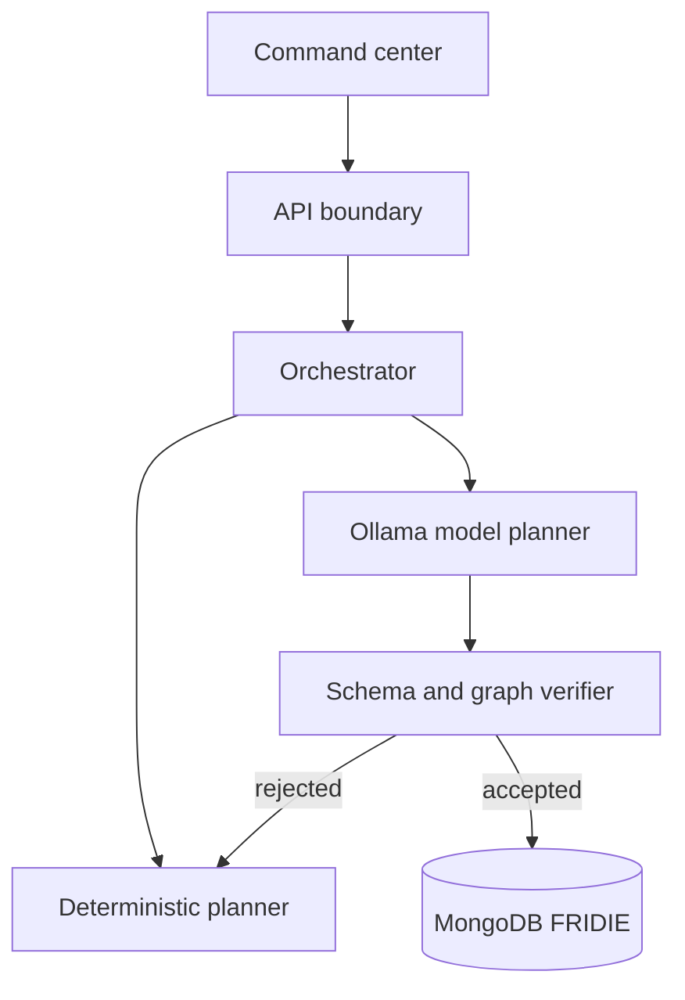

# F.R.I.D.I.E. v0.1 Architecture

The hosted web slice uses `/api/orchestrate` so the planning workflow is immediately usable without local services. Explicit approval stores a capped summary in that browser. The local production backend under `services/api` implements persistence, owner-scoped run history, idempotent approval, and a separate model-assisted planning endpoint. Ollama receives a strict JSON schema; F.R.I.D.I.E. then validates schema, ordering, dependencies, build coverage, independent verification, and final handoff. Rejected or unavailable drafts fall back to the deterministic planner and disclose that route in the response.

## Public plan contract

Each response includes `traceId`, `objective`, `summary`, `confidence`, `status`, `tasks`, `assumptions`, `limitations`, and `createdAt`. Each task includes an immutable ID, specialist owner, phase, dependency IDs, status, rationale, and acceptance check.

## Trust boundaries

- The browser never receives database credentials.
- Input is length-limited and schema-validated at both web and FastAPI boundaries.
- The API records structured audit events without storing secrets.
- Tool execution, filesystem access, and network access remain disabled until the sandbox and permission manager are implemented.
- Local LLM output will not bypass the verifier when model adapters are introduced.
- User goals are serialized as untrusted data inside the fixed model-planning prompt.
- Model output cannot request tools because the accepted schema contains planning fields only.

## Local API additions

- `GET /api/v1/runs?limit=20` lists bounded runs for the development owner scope.
- `POST /api/v1/runs/{trace_id}/approve` approves once and appends an audit event.
- `GET /api/v1/models/ollama/status` distinguishes unconfigured, unreachable, missing-model, and ready states.
- `POST /api/v1/goals/model-assisted` persists either a verifier-accepted Ollama plan or an explicitly labeled deterministic fallback.
